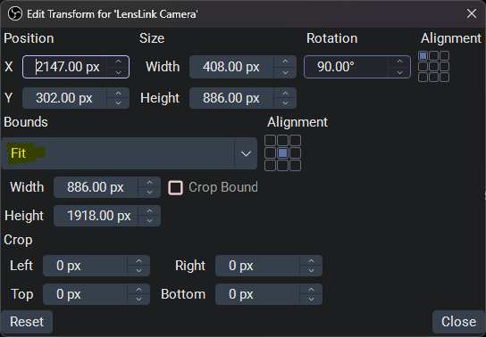

<picture>
  <source media="(prefers-color-scheme: dark)" srcset="assets/banner-dark.png">
  
</picture>

Use your iPhone or iPad as a high-quality camera **directly inside OBS
Studio** — over Wi-Fi or a USB cable. No virtual-camera drivers, no RTMP
server, no monthly subscription.

It comes in two parts: an **OBS plugin** (adds "LensLink Camera" and
"LensLink Screen" sources) and
the **LensLink iPhone/iPad app**. You install both, then OBS connects to your
phone.

## What you need

- **OBS Studio 32** or newer, on Windows, macOS, or Linux.
- An **iPhone or iPad on iOS/iPadOS 15 or later**.
- For **USB**: iTunes installed on Windows (it provides Apple's device
  driver); nothing extra on macOS.

## Install

**1. The OBS plugin.** Download the build for your system from the
[Releases](../../releases) page:

- **Windows** — run `LensLink-installer-windows-x64.exe`. It finds your
  OBS Studio folder automatically; restart OBS afterwards. (Prefer manual?
  Unzip `lenslink-windows-x64.zip` into `C:\Program Files\obs-studio\`,
  merging the `obs-plugins` and `data` folders.)
- **macOS** — open `LensLink-installer-macos-universal.pkg` (right-click →
  Open the first time; the package isn't notarized). Restart OBS.
- **Linux** — extract `lenslink-linux-x86_64.tar.gz` into
  `~/.config/obs-studio/plugins/`.
- Or build it yourself: [`obs-plugin/BUILDING.md`](obs-plugin/BUILDING.md).

**2. The LensLink app** — pick whichever suits you:

- **TestFlight (recommended):** join the beta at
  **<https://testflight.apple.com/join/N7Rth6m3>** and install from the
  TestFlight app. Updates arrive automatically; no computer or re-signing
  needed.
- **Sideloading:** download `LensLink-unsigned.ipa` from
  [Releases](../../releases) and install it with
  [Sideloadly](https://sideloadly.io) and a free Apple ID (free accounts
  expire the app weekly — re-sign to refresh).
- **Build it yourself** with Xcode:
  [`ios-app/BUILDING.md`](ios-app/BUILDING.md).

## Connect

1. On the phone, open **LensLink**, choose your camera/resolution/frame rate,
   and tap **Start**. The app shows the phone's IP address.
2. In OBS, add a source: **Sources → + → LensLink Camera** (or **LensLink
   Screen** to mirror the phone's screen instead — see below).
3. Point it at your phone:
   - **Wi-Fi** — enter the IP the app shows as the **Phone IP**. (Phone and
     computer must be on the same network.)
   - **USB** — connect the cable, set **Connection → USB cable**. No
     network needed, and the phone charges while streaming.

The video appears within a second or two. Closing or backgrounding the app
blanks the source.

## Features

- **Wi-Fi or USB.** USB needs no network at all, is lower-latency, and
  charges the phone as you stream.
- **Up to 4K at 60 fps**, in **H.264 or HEVC** (HEVC looks the same at
  ~40% less data). The app only offers resolution/frame-rate combinations
  your specific camera supports.
- **Pick any lens** — Main, Ultra Wide, Telephoto, or Front — switchable
  live while you stream.
- **Portrait or landscape.** Turn on **Match phone orientation** and the
  stream rotates with the phone — portrait rigs get real portrait video.
  (The OBS source resizes on rotation; pin it with a "Scale to inner
  bounds" transform, as with screen mirroring.)
- **Multiple cameras.** Add one "LensLink Camera" source per phone. On USB you
  can pin a source to a specific device so the same phone always maps to
  the same source.
- **Live camera controls**, both on the phone (full-screen view with pinch
  zoom, tap-to-focus, exposure, focus lock, flashlight, camera flip) and
  **from your computer** via a browser panel at
  `http://localhost:9980` (zoom / exposure / focus / flashlight / flip,
  plus switching lens, resolution, frame rate, and codec mid-stream).
- **Remote start.** With the app open, OBS can start the camera for you —
  automatically when the source connects, or from a button in the source's
  properties or the browser panel. Siri works too: *"Start streaming with
  LensLink."* Great for a phone mounted out of reach. (See "Remote start"
  below.)
- **Screen mirroring.** Mirror your whole iPhone/iPad screen — with the
  app's audio — into a dedicated **LensLink Screen** source; great for
  mobile games or app demos. Works over Wi-Fi or USB, encoded in HEVC for
  bandwidth-friendly quality. Your microphone isn't sent — mic yourself in
  OBS as usual.
- **Phone mic audio (optional).** Turn on **Send phone mic to OBS** and the
  camera source carries the phone's microphone as its audio — the phone
  doubles as a wireless mic. (Off by default; most streamers use their own
  mic and lip-sync it instead.)
- **Automatic lip sync.** The plugin measures the camera's latency and can
  automatically line up a separate microphone with the video — no guessing
  at delay values. (See "Lip sync" below.)
- **Smooth on weak Wi-Fi.** If the connection congests, the app lowers
  quality briefly and recovers, instead of piling up latency.
- **Battery saver.** While streaming, the phone screen dims after a few
  seconds; tap to wake it. Optionally, enable **Disconnect when this source
  isn't shown anywhere** in the source properties and the phone stops
  streaming entirely whenever the source is hidden, reconnecting when shown.

## Remote start

A phone mounted behind a monitor or on a rig shouldn't need to be pulled
down just to tap **Start**. While LensLink is open and idle, OBS can start
the camera for you (turn off with the app's **Remote start from OBS**
option):

- **Automatically.** The LensLink Camera source's **"Start the phone's
  camera automatically when it's ready"** option (on by default) starts
  the stream as soon as the open, idle app becomes reachable. Open the
  app — by hand, with Siri, or from a Shortcuts automation — and the
  video just appears in OBS.
- **A button in OBS.** The source's properties have **Start camera on the
  phone**, and the browser panel (`http://localhost:9980`) shows a
  **Start camera** button whenever the app is connected but idle.
  (Scriptable, too: `POST http://localhost:9980/api/control` with body
  `{"cmd":"start_stream"}`.)
- **Siri / Shortcuts.** *"Hey Siri, start streaming with LensLink"* opens
  the app and starts the camera (iOS 16+). The **Start/Stop Camera
  Stream** actions are available in the Shortcuts app for automations; on
  iOS 15, use an "Open URL" action with `lenslink://start` or
  `lenslink://stop`.
- **Hide/show follows too.** With **Disconnect when this source isn't
  shown anywhere** enabled, hiding the source now stops the phone's
  camera entirely and showing it starts it again — automatic power
  management for scene switching.

iOS only runs the camera (and LensLink's listener) while the app is on
screen, so remote start works whenever the app is in the foreground —
that's why the Siri/Shortcut path opens the app first. Stopping the
stream on the phone won't ping-pong: OBS only auto-starts when the app
has just become reachable, not after you pressed Stop.

## Screen mirroring

Add a **LensLink Screen** source in OBS, then tap **Mirror screen to OBS**
in the app to send your whole iPhone/iPad screen (plus the app's audio). It
uses iOS's built-in screen broadcast, so it works from any app — pick
**LensLink Screen** in the broadcast picker and tap **Start Broadcast**.

Note: DRM-protected audio (Apple Music, Spotify, Netflix) is muted by iOS
during any screen broadcast — that's an iOS rule, not a LensLink limit.
Game/app/browser audio comes through fine. To *hear* the audio on the
computer (not just record/stream it), set the source's **Audio Monitoring →
Monitor and Output** in OBS's Advanced Audio Properties.

**Locking the source size.** A screen mirror reports whatever resolution
iOS is broadcasting, and that can differ between apps and orientations, so
the OBS source may resize when you switch. To pin it to a fixed box on your
canvas, right-click the source → **Transform** → **Edit Transform…** and set
**Bounding Box Type** to **Scale to inner bounds** ("Fit"). OBS then scales
each incoming size to fit your box instead of resizing the layout.

  

The LensLink Screen source has no camera controls (and no browser panel) —
its properties are just the connection, decoding, and diagnostics. Each
source type accepts only its own stream: a LensLink Screen source rejects a
camera stream (and vice versa), with the Status field in the source's
properties explaining what to switch.

## Lip sync

Streamers usually use their own microphone, not the phone's. The plugin can
line that mic up with the video automatically:

1. In the LensLink Camera source properties, pick your microphone under
   **Lip-sync audio source** and enable **Auto-calibrate**.
2. In the app, turn on **Auto lip-sync reference**.

The phone then sends its microphone purely as a *timing reference* (never
heard on stream); the plugin compares it with your real mic to measure the
exact offset and correct it. If your mic is *slower* than the video (some
USB audio interfaces are), enable **Auto video delay** and it delays the
video to match instead.

## Latency

Over USB you can expect roughly **60 ms** from the camera to OBS at 1080p
or 4K; Wi-Fi is a little higher and more variable. The plugin shows a live
latency figure in the source's Status field and the OBS log.

A few things already minimize it: GPU-accelerated decoding, low-latency
decode settings, and dropping (rather than queuing) frames when the link
stalls. **USB is the most consistent** and immune to Wi-Fi hiccups. For the
lowest possible delay, use USB and good lighting (brighter scenes let the
camera expose faster).

## Tips & troubleshooting

- **USB device not found (Windows):** make sure iTunes is installed — it
  provides the driver the plugin needs — and tap **Trust** on the phone
  when prompted.
- **Source shows as "iOS Camera" / updates don't seem to apply:** an old
  pre-1.0 copy of the plugin (`ios-camera-source.dll`) is still installed
  and wins over the current one (the OBS log shows *"Source
  'ios_camera_source' already exists"*). Delete
  `obs-plugins\64bit\ios-camera-source.dll` and
  `data\obs-plugins\ios-camera-source\` from your OBS folder, then restart
  OBS. The installer now removes it automatically.
- **The app stops working after a week (sideloaded only):** free Apple IDs
  expire sideloaded apps every 7 days. Re-install it with Sideloadly to
  refresh (settings are kept) — or switch to the TestFlight build, which
  doesn't have this problem.
- **Two sources, same phone:** one phone can feed one source at a time. A
  second source aimed at the same device will say it's already in use.
  Exception: with **Disconnect when this source isn't shown anywhere**
  enabled, a hidden source releases the phone — so a Camera source in one
  scene and a Screen source in another can share it.
- **Wi-Fi latency spikes when zoomed in:** heavy digital zoom is harder to
  compress; use the Telephoto lens for clean magnification, or switch to
  USB.
- The stream is unencrypted on your local network — intended for trusted
  home/studio networks.

## Contributing

Architecture, the wire protocol, and the build/release setup are documented
in [`docs/DEVELOPMENT.md`](docs/DEVELOPMENT.md). Planned improvements and
recommended future work live in [`docs/ROADMAP.md`](docs/ROADMAP.md);
performance ground rules in [`docs/PERFORMANCE.md`](docs/PERFORMANCE.md).
